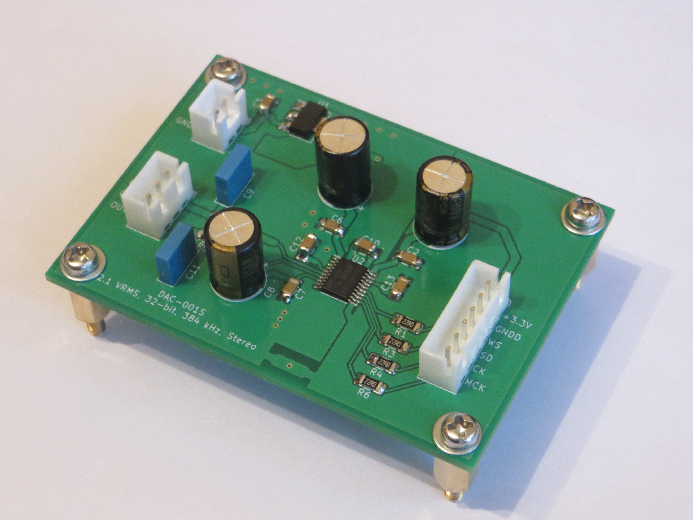

# DAC-001S
I2S Audio Stereo DAC

## Schematic

## Bill of Materials

| Ref              | Value                 | Qnty |
|:----------------:| --------------------- |:----:|
| C1, C5, C8       | 10uF                  | 3    |
| C2, C6, C7, C13  | 0.1uF, 5%, C0G, 1206  | 4    |
| C3, C4, C10, C12 | 2.2uF, 10%, X7R, 1206 | 4    |
| C9, C11          | 2.2nF, 5%             | 2    |
| J1               | B2B-XH-A(LF)(SN)      | 1    |
| J2               | B3B-XH-A              | 1    |
| J3               | B6B-XH-A              | 1    |
| R1, R3, R4, R6   | 22, 1%, 1206          | 4    |
| R2, R5           | 470, 1%, 1206         | 2    |
| U1               | ADP3338AKCZ-3.3RL7    | 1    |
| U2               | PCM5102APWR           | 1    |
